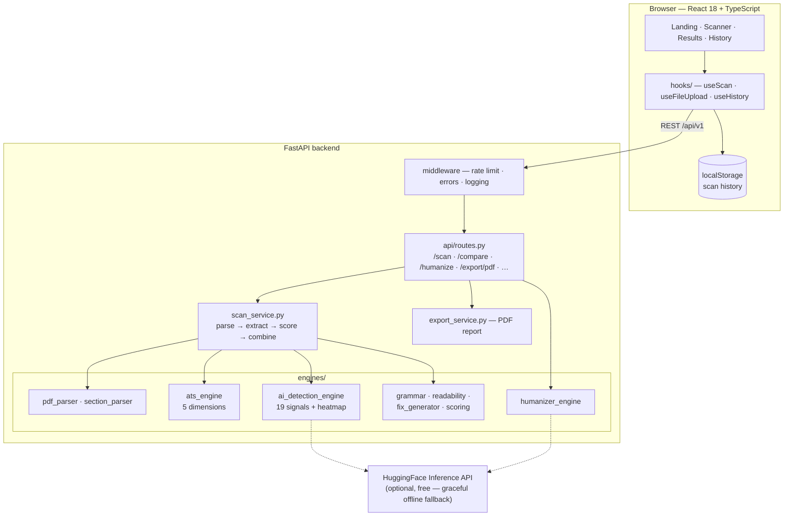
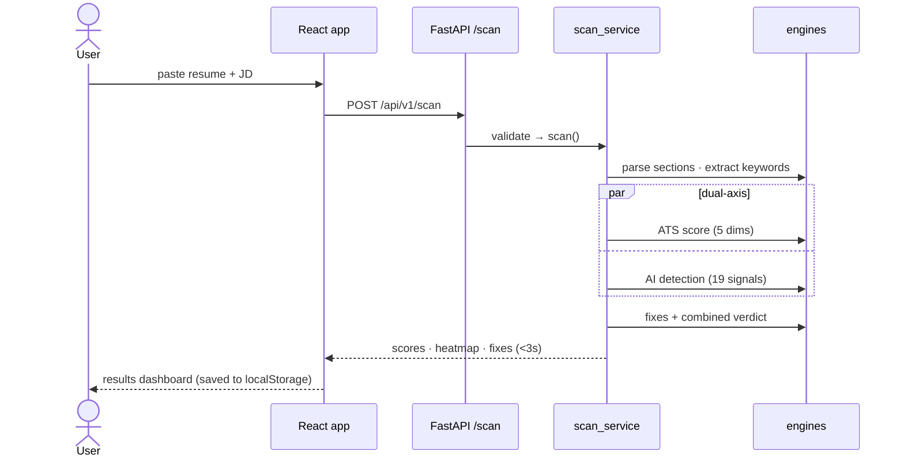

<div align="center">

# Litmus

**The litmus test your resume takes before anyone reads it — dual-axis scoring for ATS compatibility and AI-detection risk, with fixes for everything it finds.**

[](https://github.com/Gauthambinoy20/litmus/actions/workflows/ci.yml)
[](https://github.com/Gauthambinoy20/litmus/actions/workflows/security.yml)
[](https://github.com/Gauthambinoy20/litmus/actions/workflows/codeql.yml)
[](backend/requirements.txt)
[](backend/requirements.txt)
[](frontend/package.json)
[](frontend/package.json)
[](LICENSE)

[**Docs**](docs/) · [**Report a bug**](https://github.com/Gauthambinoy20/litmus/issues)

<!-- Live Demo link: restore after the Vercel re-point -->
<!-- demo.gif: record once ffmpeg is available -->


</div>

---

## About

Most resumes are filtered twice before a human reads them: once by an ATS keyword matcher, and increasingly by AI-detection tooling that flags machine-written text. Litmus is the only scanner that tests **both axes in one pass** — paste a resume and the job description, and in under 3 seconds you get an ATS score across 5 dimensions, an AI-risk score from 19 explainable signals, a per-bullet heatmap, and a prioritized fix list. It runs entirely free and offline: no API keys, no accounts, and nothing is ever stored server-side.

> ✍️ TODO: my words — why I built this

---

<details>
<summary><b>Table of Contents</b></summary>

- [Features](#features)
- [Screenshots](#screenshots)
- [Quick Start](#quick-start)
- [Configuration](#configuration)
- [Usage](#usage)
- [Project Structure](#project-structure)
- [Architecture](#architecture)
- [Tech Stack](#tech-stack)
- [Key Technical Decisions](#key-technical-decisions)
- [Testing](#testing)
- [Deployment & Scaling](#deployment--scaling)
- [Roadmap](#roadmap)
- [What I'd Do Differently](#what-id-do-differently)
- [How I Used AI Tools](#how-i-used-ai-tools)
- [Contributing](#contributing)
- [License](#license)
- [Acknowledgements](#acknowledgements)

</details>

---

## Features

- **Dual-axis scan** — ATS compatibility and AI-detection risk scored simultaneously, in one request
- **19 explainable AI signals** — every flag shows *why* it fired, with a per-bullet risk heatmap
- **Fix generator** — each finding becomes a prioritized, concrete suggestion with an example rewrite
- **Humanizer** — rewrites flagged text via layered transforms (rule-based + optional free ML paraphrase)
- **PDF/DOCX upload, bulk scanning, version comparison, PDF report export**
- **Grammar & readability checks** — Flesch-Kincaid metrics plus the embarrassing-typo class of errors
- **Free and private by design** — works fully offline; history lives only in your browser

---

## Screenshots

| Landing — paste and scan | Results — dual-axis dashboard |
|---|---|
|  |  |

| AI heatmap — per-bullet risk | History — local trend tracking |
|---|---|
|  |  |

---

## Quick Start

### Prerequisites
- Python >= 3.12 and Node.js >= 22 — or just **Docker**

> One-command setup: `docker compose up --build` — backend and frontend start together
> (frontend → http://localhost:3000 · API docs → http://localhost:8000/docs)

### Install & Run (local)

```bash
# 1. Clone
git clone https://github.com/Gauthambinoy20/litmus.git
cd litmus

# 2. Backend
cd backend
python3 -m venv .venv && source .venv/bin/activate
pip install -r requirements.txt -r requirements-dev.txt
python -m spacy download en_core_web_sm
python -c "import nltk; [nltk.download(p) for p in ['punkt','punkt_tab','stopwords','averaged_perceptron_tagger']]"
uvicorn app.main:app --reload --port 8000

# 3. Frontend (new terminal)
cd frontend
npm ci
npm run dev            # → http://localhost:5173
```

### Run the tests

```bash
cd backend && pytest tests/ --cov=app    # 116 tests, offline
cd frontend && npx vitest run            # 29 tests
```

---

## Configuration

Litmus runs with **zero configuration** — every variable below is optional.

| Variable | Description | Required | Default |
|---|---|---|---|
| `ENVIRONMENT` | `development` (console logs) / `production` (JSON logs) | No | `development` |
| `LOG_LEVEL` | `DEBUG` / `INFO` / `ERROR` | No | `INFO` |
| `RATE_LIMIT_ENABLED` | Per-IP scan rate limiting | No | `true` |
| `RATE_LIMIT_PER_HOUR` / `RATE_LIMIT_PER_DAY` | Scan quota per client | No | `5` / `15` |
| `HUGGINGFACE_API_KEY` | Enables the free ML classifier + paraphrase layers; full local fallback without it | No | — |
| `VITE_API_URL` | (frontend) backend base URL | No | `/api/v1` |

Full list in [`backend/.env.example`](backend/.env.example) and [`frontend/.env.example`](frontend/.env.example).

---

## Usage

Real call, real response — the quick scan endpoint:

```bash
curl -X POST http://localhost:8000/api/v1/scan/quick \
  -H "Content-Type: application/json" \
  -d '{
    "resume_text": "John Smith\njohn.smith@email.com\n\nSUMMARY\nBackend engineer with 6 years of experience building Python services...\n\nSKILLS\nPython, FastAPI, PostgreSQL, Redis, Docker, Kubernetes, AWS",
    "jd_text": "Senior Backend Engineer with strong Python skills (FastAPI preferred), PostgreSQL, Redis, Docker, Kubernetes and AWS experience."
  }'
```

```json
{
  "scan_id": "51754d0d-fe72-4ee2-9bcf-86600363be20",
  "ats_keyword_score": 88,
  "ai_detection_score": 21.0,
  "readiness_level": "INTERVIEW_READY",
  "processing_time_ms": 128
}
```

The full scan (`POST /api/v1/scan`) additionally returns the 5-dimension ATS breakdown, all 19 AI signals, the per-bullet heatmap, fixes, grammar and readability blocks. All endpoints are browsable at `/docs` (OpenAPI).

| Endpoint | Purpose |
|---|---|
| `POST /api/v1/scan` | Full dual-axis scan (text input) |
| `POST /api/v1/scan/file` | Scan an uploaded PDF/DOCX |
| `POST /api/v1/scan/bulk` | Scan multiple files |
| `POST /api/v1/scan/quick` | Lightweight keyword-only scan |
| `POST /api/v1/compare` | Compare two resume versions |
| `POST /api/v1/humanize` | Rewrite AI-flagged text |
| `POST /api/v1/export/pdf` | Generate the PDF report |
| `POST /api/v1/keywords/extract` | Extract keyword sets from a JD |
| `GET /api/v1/health` · `GET /api/v1/stats` | Health & aggregate stats |

---

## Project Structure

```
litmus/
├── backend/
│   ├── app/
│   │   ├── api/         # routes, middleware, dependencies
│   │   ├── engines/     # the scorers: ats, ai_detection (19 signals),
│   │   │                # humanizer, grammar, readability, fix_generator,
│   │   │                # scoring, pdf_parser, section_parser, keyword_extractor
│   │   ├── services/    # scan orchestration, PDF export, analytics
│   │   ├── models/      # pydantic schemas
│   │   └── utils/       # validators, exceptions, logging
│   └── tests/           # 116 pytest tests (offline — external HTTP blocked)
├── frontend/
│   └── src/
│       ├── components/  # Landing, Scanner, Results, History, Layout, common
│       ├── hooks/       # useScan, useFileUpload, useHistory, …
│       └── __tests__/   # 29 vitest tests
├── api/                 # Vercel serverless wrapper
├── docs/                # Mermaid diagrams + screenshots
├── .github/             # CI, Security, CodeQL workflows + Dependabot
└── docker-compose.yml
```

---

## Architecture



A scan request validates input, parses sections (with inference for header-less resumes), then runs both scoring axes in parallel — ATS against the extracted JD keywords, AI detection across all 19 signals — before the fix generator and combined scorer fold everything into one response. The backend holds no state; the browser's localStorage is the only persistence.



Full detail in [`docs/`](docs/): [Architecture](docs/architecture.md) · [Data flow (DFD)](docs/data-flow.md) · [Scan sequence](docs/scan-sequence.md)

---

## Tech Stack

- **Frontend:** React 18, TypeScript 5, Vite, Tailwind CSS
- **Backend:** FastAPI (Python 3.12), pydantic v2, structlog
- **NLP/ML:** spaCy, NLTK, scikit-learn; optional RoBERTa classifier via the free HuggingFace inference tier
- **Documents:** pdfplumber, python-docx (parse) · reportlab (PDF reports)
- **Infra:** Docker Compose, GitHub Actions (CI + gitleaks + Trivy + CodeQL + Dependabot)

---

## Key Technical Decisions

| Decision | Why | Trade-off accepted |
|---|---|---|
| 19 explainable signals instead of one ML classifier | Users see *why* each bullet was flagged; deterministic and free at any volume | More code to maintain than calling a model API |
| ML as one vote of 19, never a dependency | Offline/unauthenticated, the other 18 signals carry the result — no "service unavailable" state | Slightly lower detection ceiling without the classifier |
| No LLM in the scoring path | Scoring must be <3s, deterministic and $0 at any volume | The humanizer's rewrites are template-bound rather than fully generative |
| Stateless backend, history in localStorage | Privacy is trivially auditable; no DB to secure, scale or pay for | Aggregate stats reset on restart; no cross-device history |
| spaCy `en_core_web_sm` | Small image, fast cold start, free | No word vectors — relevance scoring uses context tensors + TF-IDF fallback |
| Engines as independent modules with `degraded_mode` | One failing engine degrades the scan instead of failing it; each is testable in isolation | Orchestration layer carries fallback logic |

> ✍️ TODO: my words

---

## Testing

```bash
cd backend && pytest tests/ --cov=app     # 116 tests · 79% coverage
cd frontend && npx vitest run             # 29 tests
```

- **Offline by construction** — an autouse fixture blocks all external HTTP, so the HuggingFace layers are tested through their fallback paths and the suite is deterministic and free
- Covers every engine, service and route: happy paths **and** failure paths (empty input, oversized files, corrupt PDFs, unauthorized formats)
- Same gates as CI: `ruff` + `ruff format` + `mypy` + `bandit` (backend) · `eslint --max-warnings 0` + `prettier` + `tsc` (frontend)

---

## Deployment & Scaling

- **Deploy:** containerized — runs anywhere that takes a Docker image; `docker compose up` is the full stack. Render and Vercel manifests included.
- **On a hyperscaler (AWS terms; Azure/GCP map 1:1):** backend image on ECS Fargate behind an ALB (health check exists at `/api/v1/health`); static frontend on S3 + CloudFront; model assets baked into the image at build time for fast cold starts.
- **Scaling plan:** the backend is stateless, so scale-out is plain horizontal replicas — no sticky sessions, no shared state. Rate limiting moves to API Gateway/WAF or an ElastiCache token bucket; ML classifier calls move to a small internal inference service cached by text hash (the engine already caches in-process); structlog's JSON output ships to CloudWatch.

---

## Roadmap

- [x] Dual-axis scan engine (ATS + 19-signal AI detection)
- [x] Fix generator, humanizer, grammar & readability
- [x] PDF/DOCX upload, bulk scan, comparison, PDF export
- [x] Full CI/CD with security gates — 0 known CVEs
- [ ] Re-point live demo to this repo
- [ ] OCR for scanned-image PDFs
- [ ] Multi-language resume support

Migration history and known issues: [ROADMAP.md](ROADMAP.md)

---

## What I'd Do Differently

- **Grammar engine:** the regex approach catches the embarrassing class of errors cheaply, but a real grammar library would catch more — none currently fit the free/fast constraint.
- **Relevance scoring:** a vectored spaCy model would sharpen the ATS relevance dimension, at the cost of image size and cold-start time.
- **Known limitations:** no OCR (scanned-image PDFs are rejected with a clear error); English-only; resumes over 15k characters are rejected rather than chunked.
- **Edge cases consciously skipped:** multi-column resume layouts parse but lose some ordering fidelity; non-Latin scripts untested. Time-boxed — low priority for the target use case.

> ✍️ TODO: my words

---

## How I Used AI Tools

> ✍️ TODO: my words

---

## Contributing

Contributions welcome. See [CONTRIBUTING.md](CONTRIBUTING.md) for local setup, code standards and the PR workflow. Open an issue before large changes.

---

## License

Distributed under the MIT License. See [LICENSE](LICENSE).

---

## Acknowledgements

- [spaCy](https://spacy.io) and [NLTK](https://www.nltk.org) for the NLP foundations
- [pdfplumber](https://github.com/jsvine/pdfplumber) for PDF extraction that just works
- [HuggingFace](https://huggingface.co) for the free inference tier powering the optional ML layers
