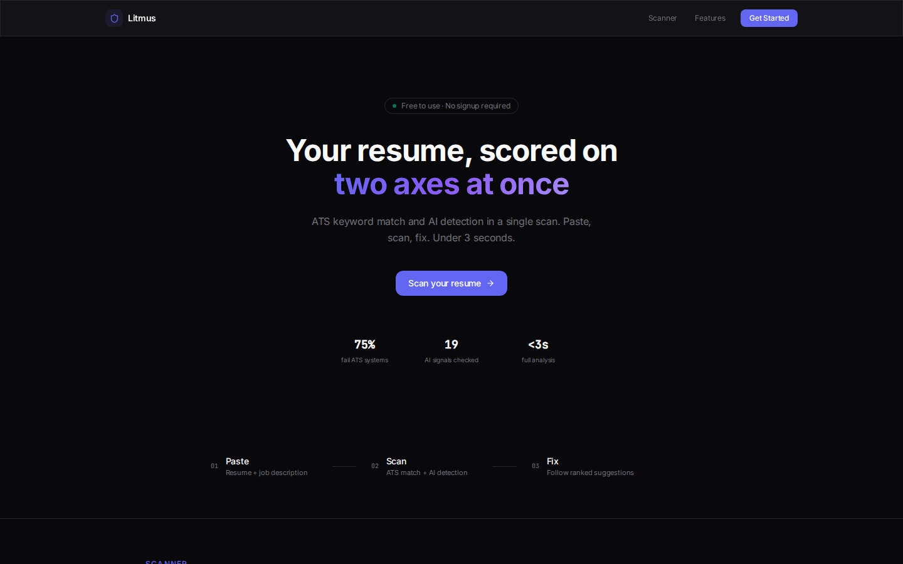
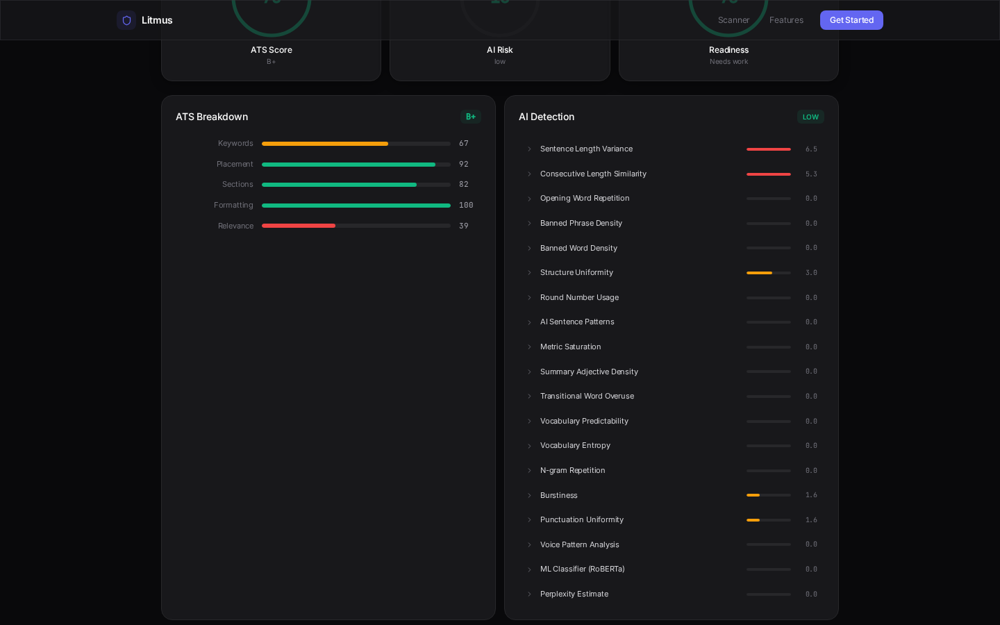
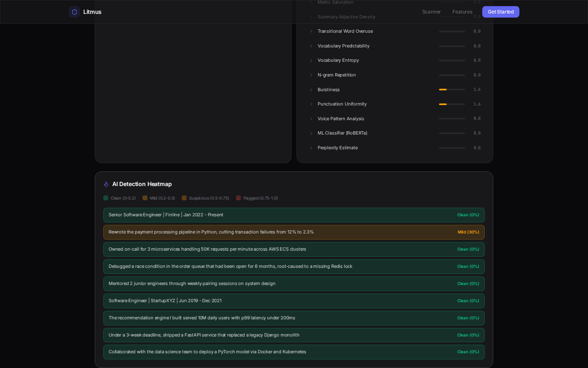
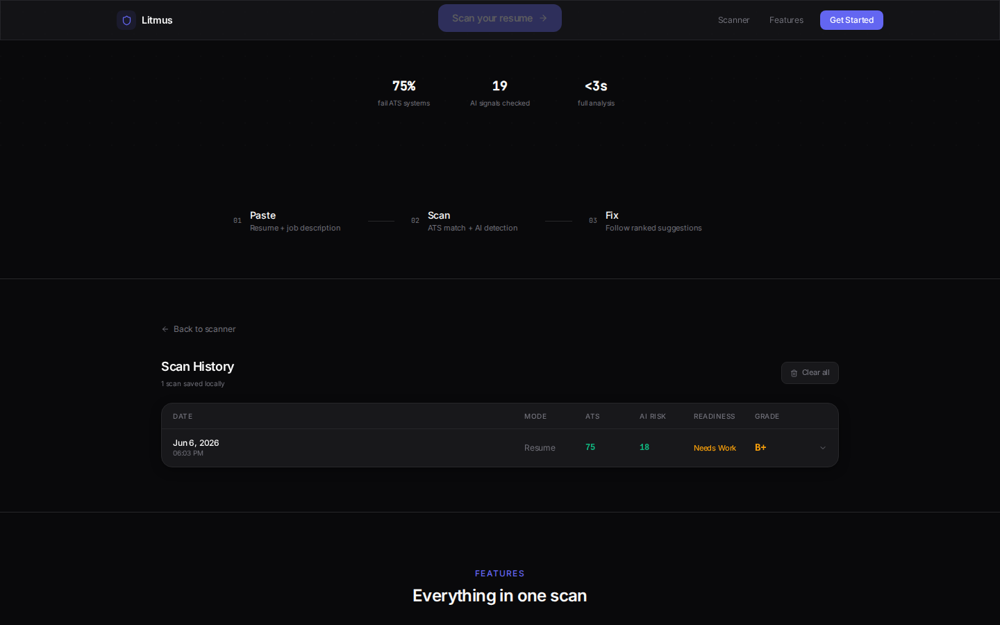

# Litmus

**The litmus test your resume takes before anyone reads it.**

<!-- Live demo: re-point Vercel to this repo, then restore the link here -->


## About

Litmus is a **dual-axis resume scanner**: it scores a resume against a job description for **ATS keyword compatibility** (5 dimensions) and simultaneously for **AI-generated text risk** (19 detection signals), then turns every finding into an actionable fix. Results land in under 3 seconds, and the whole product runs **offline and free** — no API keys, no accounts, nothing stored server-side.

> ✍️ TODO: my words — why I built this

<details>
<summary><b>Table of Contents</b></summary>

- [Features](#features)
- [Screenshots](#screenshots)
- [Quick start](#quick-start)
- [Configuration](#configuration)
- [Project structure](#project-structure)
- [Architecture](#architecture)
- [Detection approach & ML decisions](#detection-approach--ml-decisions)
- [Key technical decisions & why](#key-technical-decisions--why)
- [Engineering standards](#engineering-standards)
- [Productionizing & scaling](#productionizing--scaling)
- [How I used AI tools](#how-i-used-ai-tools)
- [What I'd do differently](#what-id-do-differently)
- [API](#api)
- [Roadmap](#roadmap)
- [License](#license)

</details>

## Features

- **ATS engine** — keyword match, keyword placement, section completeness, formatting, semantic relevance
- **AI-detection engine** — 19 signals (sentence-length variance, opener diversity, banned-phrase density, adjective stacking, ML classifier, …) with a per-bullet risk heatmap
- **Fix generator** — every flagged issue becomes a prioritized, concrete suggestion with an example
- **Humanizer** — rewrites AI-flagged text via layered transforms (optional free ML paraphrase + rule-based)
- **Grammar & readability** — grammar checks, Flesch-Kincaid metrics
- **PDF/DOCX upload** and **bulk scanning**, **resume comparison**, **PDF report export**
- **Privacy by design** — stateless backend, nothing stored server-side; history lives in your browser

## Screenshots

| Landing | Results |
|---|---|
|  |  |

| AI Detection Heatmap | Scan History |
|---|---|
|  |  |

## Quick start

### Docker (one command)

```bash
docker compose up --build
# frontend → http://localhost:3000 · backend → http://localhost:8000/docs
```

### Local

```bash
# Backend
cd backend
python3 -m venv .venv && source .venv/bin/activate
pip install -r requirements.txt -r requirements-dev.txt
python -m spacy download en_core_web_sm
python -c "import nltk; [nltk.download(p) for p in ['punkt','punkt_tab','stopwords','averaged_perceptron_tagger']]"
uvicorn app.main:app --reload --port 8000

# Frontend (new terminal)
cd frontend
npm ci
npm run dev   # → http://localhost:5173
```

### Tests & quality gates

```bash
cd backend && pytest tests/ --cov=app          # 116 tests
cd backend && ruff check app/ tests/ && ruff format --check app/ tests/ && mypy app/ && bandit -r app/ -q -ll

cd frontend && npx vitest run                  # 29 tests
cd frontend && npx eslint src --max-warnings 0 && npx prettier --check src && npx tsc --noEmit
```

## Configuration

All settings are optional — Litmus runs with zero configuration. Backend reads `backend/.env` (see [`.env.example`](backend/.env.example)):

| Variable | Default | Purpose |
|---|---|---|
| `ENVIRONMENT` | `development` | Switches log rendering (console vs JSON) |
| `LOG_LEVEL` | `INFO` | structlog level |
| `RATE_LIMIT_ENABLED` | `true` | Toggle per-IP rate limiting |
| `RATE_LIMIT_PER_HOUR` / `RATE_LIMIT_PER_DAY` | `5` / `15` | Scan quota per client |
| `HUGGINGFACE_API_KEY` | *(empty)* | Enables the free ML classifier + paraphrase layers; graceful local fallback without it |
| `SENTRY_DSN` | *(empty)* | Reserved; unused in the default build |

Frontend (`frontend/.env`):

| Variable | Default | Purpose |
|---|---|---|
| `VITE_API_URL` | `/api/v1` | Backend base URL; default uses the dev-server proxy |

## Project structure

```
litmus/
├── backend/
│   ├── app/
│   │   ├── api/            # routes, middleware, dependencies
│   │   ├── engines/        # ats, ai_detection (19 signals), humanizer,
│   │   │                   # grammar, readability, fix_generator, scoring,
│   │   │                   # pdf_parser, section_parser, keyword_extractor
│   │   ├── services/       # scan orchestration, PDF export, analytics
│   │   ├── models/         # pydantic schemas
│   │   ├── utils/          # validators, exceptions, logging, text processing
│   │   ├── config.py       # single source of truth for settings/version
│   │   └── main.py         # FastAPI app factory
│   └── tests/              # 116 pytest tests (offline, external HTTP blocked)
├── frontend/
│   └── src/
│       ├── components/     # Landing, Scanner, Results, History, Layout, common
│       ├── hooks/          # useScan, useFileUpload, useHistory, …
│       ├── services/       # typed API client
│       ├── utils/          # validators, formatters, history store
│       └── __tests__/      # 29 vitest tests
├── api/                    # Vercel serverless wrapper
├── docs/                   # Mermaid diagrams + screenshots
├── .github/                # CI, Security, CodeQL workflows + Dependabot
└── docker-compose.yml
```

## Architecture

Diagrams (Mermaid, derived from the code) live in [`docs/`](docs/):
[Architecture](docs/architecture.md) · [Data flow](docs/data-flow.md) · [Scan sequence](docs/scan-sequence.md)

```
React 18 + TS (Vite, Tailwind)  →  FastAPI  →  engines/ (ATS · AI-detection · grammar ·
readability · humanizer · fix generator)  +  services/ (scan · export · analytics)
```

## Detection approach & ML decisions

- **Signals over a single model.** AI detection is 19 independent, explainable signals (structure, vocabulary, rhythm, metric saturation, …) combined into one score — each signal shows the user *why* it fired, which a black-box classifier can't.
- **ML as one vote, never a dependency.** The RoBERTa-based classifier (free HuggingFace inference tier) is signal #19 of 19. Offline or unauthenticated it contributes a zero score and the other 18 carry the result — the product never degrades to "unavailable".
- **spaCy `en_core_web_sm` deliberately.** No word vectors, but it keeps cold-start small, inference fast and the install free; the ATS relevance dimension uses context tensors plus TF-IDF/overlap fallbacks instead.
- **No LLM in the scoring path.** Scoring must be deterministic, fast (<3s) and free at any volume; LLM calls would break all three. The humanizer's rewrite layer is rule-based with an optional free paraphrase model on top.

> ✍️ TODO: my words — anything you'd add on the modelling trade-offs

## Key technical decisions & why

| Decision | Why |
|---|---|
| Stateless backend, history in localStorage | Privacy story is trivially auditable; no DB to secure, scale or pay for |
| FastAPI + pydantic v2 | Typed request/response contracts shared with the TS client; free OpenAPI docs |
| Engines as independent modules | Each scorer is testable in isolation; a failing engine degrades the scan (`degraded_mode`) instead of failing it |
| Everything pinned, two requirement sets | Runtime vs dev split keeps the deploy image lean; CI installs exactly what's audited |
| Free-tier-only external calls with local fallbacks | The app must be fully functional at $0 — every external call has an offline path |

> ✍️ TODO: my words

## Engineering standards

**Followed:** characterization tests before changes; external HTTP blocked in tests (deterministic, offline); ruff + mypy + bandit + eslint + prettier + tsc at zero warnings; pinned dependencies with real CVE fixes (no allowlists — 0 known vulns at last audit); least-privilege CI with concurrency-cancel; secrets only via env (`.env` git-ignored, `.env.example` committed); conventional commits.

**Consciously skipped:** server-side persistence and auth (privacy-by-design scope choice); E2E browser tests in CI (covered by unit + smoke layers; Playwright is used manually for screenshots); i18n; load testing (single-tenant scale).

## Productionizing & scaling

Current deploy targets are free tiers (Vercel frontend + serverless wrapper, or `docker compose` on any VM). On a hyperscaler (AWS terms; Azure/GCP equivalents map 1:1):

1. **Containers:** backend image → ECS Fargate behind an ALB; frontend static build → S3 + CloudFront. Health checks already exist (`/api/v1/health`).
2. **Scale-out is trivial** because the backend is stateless — horizontal replicas behind the ALB, no sticky sessions, no shared state. Rate limiting moves from in-process to API Gateway / WAF rules or an ElastiCache token bucket.
3. **Model assets** (spaCy/NLTK data) bake into the image at build time — no runtime downloads, fast cold starts.
4. **Observability:** structlog already emits JSON in production mode → ship to CloudWatch; add traces via OTEL middleware.
5. **Heavy-load path:** move ML classifier calls to a small internal inference service (or SageMaker serverless) and cache by text hash (the engine already caches in-process).
6. **CI/CD:** the existing GitHub Actions pipeline gates merges; add an ECR push + ECS deploy job on tags.

## How I used AI tools

> ✍️ TODO: my words

## What I'd do differently

- Swap the regex grammar engine for a proper grammar library once one fits the free/fast constraint.
- A larger spaCy model (word vectors) would sharpen the ATS relevance dimension — at the cost of image size and cold-start.
- Aggregate stats are in-memory by design and reset on restart; a tiny SQLite/DynamoDB layer would persist them if that ever matters.

**Edge cases consciously skipped:** scanned-image PDFs (no OCR); non-English resumes; resumes >15k chars are rejected rather than chunked.

> ✍️ TODO: my words

## API

Interactive docs at `/docs` when the backend is running.

| Endpoint | Purpose |
|---|---|
| `POST /api/v1/scan` | Full dual-axis scan (text input) |
| `POST /api/v1/scan/file` | Scan an uploaded PDF/DOCX |
| `POST /api/v1/scan/bulk` | Scan multiple files |
| `POST /api/v1/scan/quick` | Lightweight keyword-only scan |
| `POST /api/v1/compare` | Compare two resume versions |
| `POST /api/v1/humanize` | Rewrite AI-flagged text |
| `POST /api/v1/export/pdf` | Generate the PDF report |
| `POST /api/v1/keywords/extract` | Extract keyword sets from a JD |
| `GET /api/v1/health` · `GET /api/v1/stats` | Health & aggregate stats |

## Roadmap

See [ROADMAP.md](ROADMAP.md).

## License

[MIT](LICENSE)
