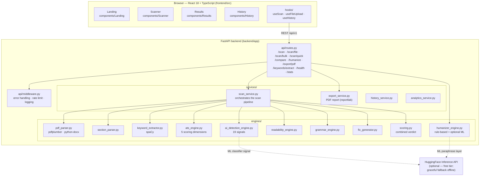

# Litmus — Architecture

Component view of the system as implemented. Every node maps to a real module or directory in this repo.

Notes
- The two dashed HuggingFace edges are **optional**: with no API key or no network, both engines fall back to fully local logic. The whole product works offline and free.
- Scan history is stored **client-side in localStorage** (`hooks/useHistory.ts`); the backend keeps only in-memory aggregate stats (`/stats`).
- No database: the backend is stateless, which is why it deploys free on any container host.
