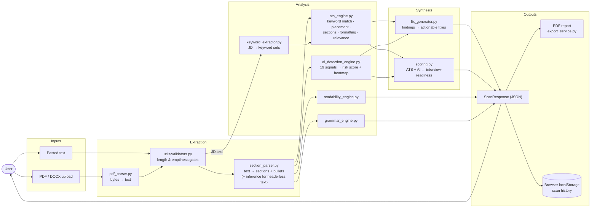

# Litmus — Data Flow Diagram

How a resume + job description move through the system, from input to scored report.

Key properties
- **Nothing persists server-side.** The resume text lives only for the duration of the request; history is the browser's localStorage.
- The JD and resume take separate extraction paths and meet in `ats_engine.py`.
- The AI-detection heatmap is computed per-bullet, so the frontend can color individual lines.
